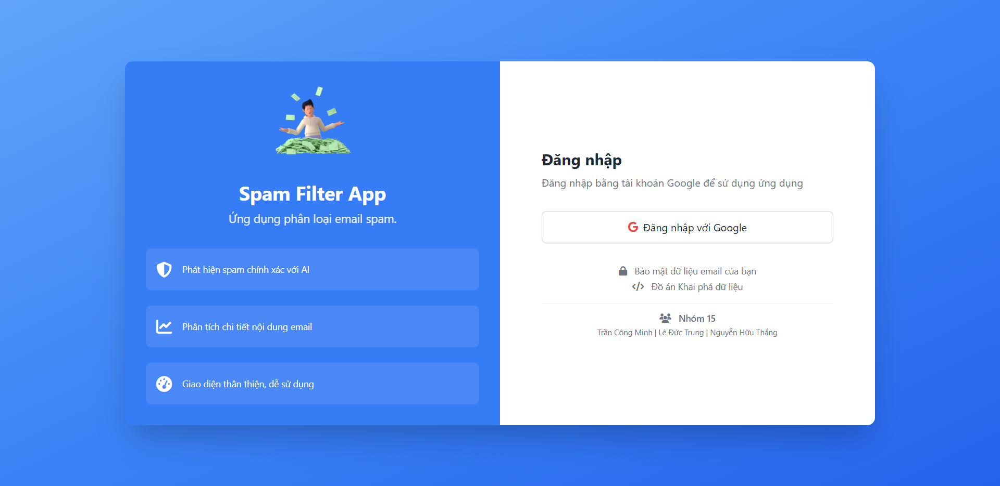

# Phân Loại Email Spam



Ứng dụng này là một hệ thống phân loại email spam sử dụng học máy để phát hiện và quản lý email spam trong tài khoản Gmail của bạn. Ứng dụng sử dụng Gmail API với OAuth 2.0 để kết nối an toàn với Gmail, cho phép bất kỳ người dùng nào cũng có thể sử dụng ứng dụng mà không cần cấu hình phức tạp.

## Tính Năng

- Tích hợp với Gmail thông qua Gmail API với xác thực OAuth 2.0
- Đăng nhập an toàn với tài khoản Google mà không cần cung cấp mật khẩu
- Phát hiện spam dựa trên học máy với mô hình Naive Bayes và TF-IDF
- Xử lý ngôn ngữ tiếng Việt với thư viện underthesea
- Phân tích và phân loại email tự động với độ tin cậy
- Phân tích từ khóa và tính năng của email spam
- Theo dõi thống kê và hiệu suất mô hình
- Giao diện người dùng thân thiện dựa trên React và Vite
- Sử dụng Tailwind CSS và React-Toastify cho trải nghiệm người dùng tốt hơn

## Cấu Trúc Dự Án

### Backend (Python/Flask)

- `app.py`: API backend Flask, xử lý các yêu cầu từ frontend, quản lý phiên làm việc và điều phối các dịch vụ
- `gmail_oauth.py`: Tích hợp Gmail API với OAuth 2.0, xử lý việc đọc, gửi và quản lý email
- `naive_bayes.py`: Mô hình học máy Naive Bayes cho việc phân loại spam, với xử lý dữ liệu tiếng Việt
- `utils.py`: Các hàm tiện ích, quản lý lỗi và xử lý phiên đăng nhập
- `config.py`: Cấu hình hệ thống như đường dẫn file, phạm vi OAuth và thiết lập Flask
- `client_secret.json`: File chứa thông tin xác thực OAuth 2.0 cho Gmail API
- `spam_data.csv`: Dữ liệu huấn luyện cho mô hình phân loại spam
- `stopwords.txt`: Danh sách từ dừng (stopwords) cho tiếng Việt, dùng trong tiền xử lý văn bản

### Frontend (React + Vite)

- `vite-frontend/`: Ứng dụng frontend React sử dụng Vite
  - `src/components/`: Các component React (EmailList, ComposeModal, EmailAnalyzer, Stats, Sidebar)
  - `src/pages/`: Các trang React (InboxPage, SpamPage, AnalyzerPage, StatsPage, LoginPage)
  - `src/services/`: Các dịch vụ API để giao tiếp với backend
  - `src/assets/`: Tài nguyên như animations, hình ảnh và logo
  - `dist/`: Thư mục chứa các tệp build của ứng dụng (được tạo sau khi build)
  - `tailwind.config.js`: Cấu hình cho Tailwind CSS

## Luồng Xử Lý Dữ Liệu

1. **Đăng nhập với OAuth 2.0**:

   - Người dùng nhấp vào nút "Đăng nhập với Google"
   - Hệ thống chuyển hướng người dùng đến trang xác thực của Google
   - Người dùng đăng nhập vào tài khoản Google và cấp quyền cho ứng dụng
   - Google chuyển hướng người dùng trở lại ứng dụng với mã xác thực
   - Ứng dụng sử dụng mã xác thực để lấy token truy cập và lưu vào phiên làm việc

2. **Quản lý Email**:

   - Đọc email từ Gmail thông qua Gmail API (hộp thư đến và thư mục spam)
   - Phân tích nội dung email để trích xuất đặc trưng
   - Áp dụng mô hình Naive Bayes với TF-IDF để dự đoán xác suất spam
   - Hiển thị kết quả cho người dùng với giao diện trực quan

3. **Phân Tích Email**:

   - Người dùng có thể phân tích nội dung email mới
   - Mô hình dự đoán xác suất spam và hiển thị các từ khóa quan trọng
   - Phân tích chi tiết các tính năng của email và độ tin cậy của phân loại
   - Người dùng có thể thêm email vào tập dữ liệu huấn luyện để cải thiện mô hình

4. **Thống Kê và Hiệu Suất**:
   - Hiển thị thống kê về số lượng email spam/ham
   - Theo dõi hiệu suất mô hình (độ chính xác, độ nhạy, độ đặc hiệu, F1-score)
   - Phân tích các mẫu spam phổ biến và từ khóa xuất hiện nhiều trong spam
   - Tạo ma trận nhầm lẫn để đánh giá hiệu suất mô hình

## Cài Đặt và Thiết Lập

### Yêu Cầu Hệ Thống

- Python 3.7+
- Node.js và npm
- Tài khoản Google
- Dự án Google Cloud với Gmail API được bật

### Thiết Lập Backend

1. Cài đặt các thư viện Python:

   ```
   pip install flask scikit-learn pandas underthesea google-auth google-auth-oauthlib google-api-python-client flask-cors joblib
   ```

2. Tạo file stopwords.txt:

   - Tạo file `stopwords.txt` trong thư mục gốc của dự án
   - Thêm danh sách từ dừng tiếng Việt vào file này (mỗi từ một dòng)

3. Thiết lập OAuth 2.0 cho Gmail API:

   - Truy cập [Google Cloud Console](https://console.cloud.google.com/)
   - Tạo dự án mới hoặc chọn dự án hiện có
   - Bật Gmail API
   - Tạo OAuth Client ID:
     - Chọn "Create Credentials" > "OAuth client ID"
     - Chọn "Web application" làm Application type
     - Thêm các URI sau vào Authorized redirect URIs:
       - `http://localhost:5001/oauth2callback`
       - `http://127.0.0.1:5001/oauth2callback`
     - Tải xuống file JSON và đổi tên thành `client_secret.json`
     - Đặt file `client_secret.json` vào thư mục gốc của dự án

4. Cấu hình OAuth consent screen:

   - Truy cập [Google Cloud Console](https://console.cloud.google.com/)
   - Chọn dự án hiện có
   - Vào mục APIs & Services -> chọn OAuth consent screen
   - Chọn loại cho ứng dụng (External hoặc Internal)
   - Nếu chọn External và Publish -> Bất kì người dùng nào cũng có thể truy cập (Cần phải đợi duyệt và cấu hình chi tiết)
   - Nếu chọn External và Test -> Add User(Email) vào để cấp quyền truy cập vào project
   - Nếu chọn Internal -> Chỉ những người dùng trong tổ chức của bạn mới có thể truy cập

### Thiết Lập Frontend

1. Cài đặt các thư viện Node.js:

   ```
   cd vite-frontend
   npm install
   ```

2. Build frontend:
   ```
   cd vite-frontend
   npm run build
   ```

## Cách Sử Dụng

1. **Khởi động ứng dụng**:

   ### Chế độ Development (Phát triển)

   **Dùng cho việc phát triển và test - có hot reload tự động**

   ```bash
   # Chạy script tự động (khuyến nghị)
   ./run_dev.sh
   ```

   Script này sẽ:
   - Tự động cài đặt dependencies cho frontend (nếu cần)
   - Khởi động Backend Flask ở http://localhost:5001
   - Khởi động Frontend Vite Dev Server ở http://localhost:5173
   - Frontend sẽ tự động proxy các API requests đến backend
   - Hỗ trợ hot reload - thay đổi code sẽ tự động cập nhật

   **Hoặc chạy thủ công:**

   Terminal 1 - Backend:
   ```bash
   python3 app.py
   # Backend chạy ở http://localhost:5001
   ```

   Terminal 2 - Frontend:
   ```bash
   cd vite-frontend
   npm install  # Chỉ cần chạy lần đầu
   npm run dev
   # Frontend chạy ở http://localhost:5173
   ```

   Sau đó truy cập: **http://localhost:5173**

   ### Chế độ Production (Triển khai)

   **Dùng để build và chạy phiên bản production**

   ```bash
   # Build frontend
   cd vite-frontend
   npm install
   npm run build
   cd ..

   # Chạy backend (sẽ serve frontend đã build)
   python3 app.py
   ```

   Sau đó truy cập: **http://localhost:5001**

   **Hoặc dùng script có sẵn:**
   - Windows: Chạy `run_app.bat`
   - macOS/Linux: Chạy `./run_mac.sh`

2. **Đăng nhập với Google**:

   - Truy cập ứng dụng và nhấp vào nút "Đăng nhập với Google"
   - Hệ thống sẽ chuyển hướng bạn đến trang xác thực của Google
   - Đăng nhập vào tài khoản Google và cấp quyền cho ứng dụng
   - Sau khi xác thực, bạn sẽ được chuyển hướng trở lại ứng dụng

### Luồng hoạt động trong Development Mode

1. **User truy cập** http://localhost:5173 (Frontend Vite Dev Server)
2. **Frontend** hiển thị trang login
3. **User click** "Đăng nhập với Google"
4. **Request** `/login` được **proxy** từ port 5173 → 5001 (Backend)
5. **Backend** tạo OAuth URL và redirect đến Google
6. **User đăng nhập** Google và cấp quyền
7. **Google redirect** về `http://localhost:5001/oauth2callback`
8. **Backend** xử lý callback, lưu credentials vào session
9. **Backend** redirect về `/` (http://localhost:5173)
10. **Frontend** kiểm tra auth và hiển thị ứng dụng

### Xử lý lỗi OAuth

Nếu bạn gặp lỗi "redirect_uri_mismatch" khi đăng nhập:

1. Kiểm tra lại các URI chuyển hướng trong Google Cloud Console:

   - Đảm bảo đã thêm cả `http://localhost:5001/oauth2callback` và `http://127.0.0.1:5001/oauth2callback`
   - Đảm bảo URI trong file `config.py` (OAUTH_REDIRECT_URI) khớp với URI đã đăng ký

2. Xóa cache trình duyệt và cookie:

   - Xóa cache và cookie của trình duyệt
   - Thử đăng nhập lại

3. Kiểm tra log ứng dụng để xem thông báo lỗi chi tiết (xem trong terminal)

### Sử dụng ứng dụng

- **Hộp thư đến**: Xem, quản lý và phân loại email trong hộp thư đến
- **Thư mục Spam**: Xem và quản lý email trong thư mục spam
- **Phân tích Email**: Nhập nội dung để kiểm tra mức độ spam và phân tích chi tiết
- **Thống kê**: Xem số liệu thống kê về email và hiệu suất mô hình
- **Soạn email**: Soạn và gửi email mới từ giao diện ứng dụng

## Tài Liệu Chi Tiết

- **[QUICKSTART.md](QUICKSTART.md)**: Hướng dẫn nhanh để chạy ứng dụng
- **[DEVELOPMENT.md](DEVELOPMENT.md)**: Chi tiết về development mode và kiến trúc
- **[ARCHITECTURE.md](ARCHITECTURE.md)**: Sơ đồ kiến trúc hệ thống
- **[TROUBLESHOOTING.md](TROUBLESHOOTING.md)**: Giải quyết các vấn đề thường gặp
- **[RETRAIN_MECHANISM.md](RETRAIN_MECHANISM.md)**: Chi tiết cơ chế huấn luyện lại mô hình
- **[RETRAIN_FLOWCHART.md](RETRAIN_FLOWCHART.md)**: Sơ đồ luồng huấn luyện mô hình

## Công Nghệ Sử Dụng

- **Backend**:

  - Flask: Framework web Python với xử lý đồng bộ
  - Flask-CORS: Hỗ trợ CORS cho Flask API
  - Gmail API: API chính thức của Google để truy cập Gmail
  - OAuth 2.0: Giao thức xác thực an toàn cho API
  - scikit-learn: Thư viện học máy cho mô hình Naive Bayes và TF-IDF
  - pandas: Xử lý và phân tích dữ liệu
  - underthesea: Thư viện NLP cho tiếng Việt
  - joblib: Lưu và tải mô hình học máy

- **Frontend**:

  - React: Thư viện JavaScript cho giao diện người dùng
  - Vite: Công cụ build và phát triển hiện đại
  - Tailwind CSS: Framework CSS tiện ích
  - React Router: Định tuyến trong ứng dụng React
  - React-Toastify: Hiển thị thông báo người dùng
  - Font Awesome: Thư viện biểu tượng

- **Lưu Trữ Dữ Liệu**:
  - joblib: Lưu mô hình Naive Bayes và vectorizer
  - Flask Session: Lưu thông tin phiên làm việc và token xác thực
  - CSV: Lưu dữ liệu huấn luyện cho mô hình
